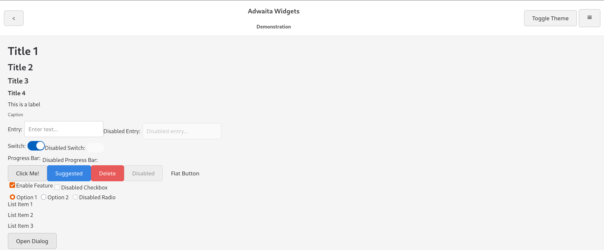

# Adwaita Web UI Framework

Vanilla JavaScript UI framework that mimics the look and feel of GNOME's GTK4 and libdwaita, making it easy to create web applications with a consistent Adwaita/GTK4 style. It uses HTML, CSS (via SCSS), and JavaScript, with no external dependencies.



## Features

- **Adwaita Styling:** Aims to closely follow the visual style and naming conventions of libadwaita for a consistent GNOME desktop look on the web.
- **Light and Dark Themes:** Built-in support for both light and dark themes. Includes automatic detection of system preference via `prefers-color-scheme`, manual toggling, and remembers the user's choice via `localStorage`.
- **Component-Based:** Provides a suite of reusable UI components as JavaScript functions (e.g., Buttons, Entries, Switches, ViewSwitcher, Flap).
- **CSS Variables:** Extensively uses CSS custom properties (variables) for theming, making customization of colors, fonts, and spacing straightforward, inspired by libadwaita's own variable system.
- **Responsive Design:** Components are designed to be reasonably responsive where applicable.
- **Accessibility (ARIA):** Incorporates ARIA roles and attributes to improve accessibility for users of assistive technologies.
- **No External Dependencies:** Written in pure JavaScript, HTML, and SCSS.

## Installation

1. **Clone or Download:** Get the code from the repository (or copy the code files directly):

   ```
   gtk-web-framework/
   ├── test.html
   ├── js/
       └── components.js
   ├── style.css           (Generated from scss/style.scss)
   ├── scss/
       ├── style.scss
       ├── _variables.scss
       ├── _base.scss
       ├── _button.scss
       ├── _entry.scss
       ├── _switch.scss
       ├── _label.scss
       ├── _headerbar.scss
       ├── _window.scss
       ├── _box.scss
       ├── _toast.scss
       ├── _dialog.scss
       ├── _progress-bar.scss
       ├── _checkbox.scss
       ├── _radio.scss
       └── _list-box.scss

   ```

2. **Install Sass:** You need a Sass compiler to convert the SCSS files into CSS. The recommended method is to use the Dart Sass command-line tool:

   ```bash
   npm install -g sass
   ```

   You can also use a VS Code extension like "Live Sass Compiler" if you prefer.

3. **Compile CSS:** Navigate to the `gtk-web-framework` directory in your terminal and run:

   ```bash
   sass scss/style.scss style.css
   ```

   For continuous development, use the `--watch` flag:

   ```bash
   sass --watch scss/style.scss:style.css
   ```

   This will automatically recompile `style.css` whenever you make changes to any of the SCSS files.

4. **Include in your HTML:** Include the compiled `style.css` and the `components.js` file in your HTML:

   ```html
   <head>
     <link rel="stylesheet" href="style.css" />
   </head>
   <body>
     <div id="app"></div>
     <script src="js/components.js"></script>
     <script>
       // Your application code using the Adw components goes here
     </script>
   </body>
   ```

## Usage

The framework provides a global `Adw` object containing functions for creating each UI component. Each function takes an `options` object to customize the appearance and behavior of the component.

**Example:**

```javascript
const myButton = Adw.createButton("Click Me", {
  onClick: () => {
    Adw.createToast("Button clicked!");
  },
  suggested: true,
});

document.getElementById("app").appendChild(myButton);
```

## Component Documentation

All components are created using functions available under the global `Adw` object (e.g., `Adw.createButton(...)`).
Detailed API information, including all options for each component, can be found in the JSDoc comments within `js/components.js`.

Here's an overview of common components and their basic usage:

### `Adw.createButton(text, options = {})`
Creates a button.
- **`text`**: `string` - Text displayed on the button.
- **`options`**: `object`
    - `onClick`: `function` - Callback for click events.
    - `suggested`: `boolean` - Styles as a suggested action (e.g., primary button).
    - `destructive`: `boolean` - Styles as a destructive action (e.g., for delete).
    - `flat`: `boolean` - Styles as a flat button (no border/background).
    - `disabled`: `boolean` - Disables the button.
    - `icon`: `string` - SVG string or icon font class for an icon. Icon is prepended.
    - `isCircular`: `boolean` - For icon-only circular buttons.
    - `href`: `string` - If provided, creates an `<a>` tag styled as a button.
- **Example:**
  ```javascript
  const saveButton = Adw.createButton("Save", { suggested: true });
  const iconButton = Adw.createButton("", { icon: "<svg><!-- dummy svg --></svg>", isCircular: true });
  ```

### `Adw.createEntry(options = {})`
Creates a text input field.
- **`options`**: `object`
    - `placeholder`: `string` - Placeholder text.
    - `value`: `string` - Initial value.
    - `onInput`: `function` - Callback for input events.
    - `disabled`: `boolean` - Disables the entry.
- **Example:**
  ```javascript
  const nameEntry = Adw.createEntry({ placeholder: "Enter your name" });
  ```

### `Adw.createSwitch(options = {})`
Creates a toggle switch.
- **`options`**: `object`
    - `checked`: `boolean` - Initial state.
    - `onChanged`: `function` - Callback when state changes.
    - `disabled`: `boolean` - Disables the switch.
    - `label`: `string` - Optional label text next to the switch.
- **Example:**
  ```javascript
  const notificationsSwitch = Adw.createSwitch({ label: "Enable Notifications", checked: true });
  ```

### `Adw.createLabel(text, options = {})`
Creates a text label. Can also be used for headings and other text elements.
- **`text`**: `string` - The text content.
- **`options`**: `object`
    - `htmlTag`: `string` - HTML tag to use (default: "label"). E.g., "p", "h1", "span".
    - `title`: `number` (1-4) - Applies heading style class `title-N`.
    - `isCaption`: `boolean` - Applies caption style.
    - `isLink`: `boolean` - Styles as a link. Provide `onClick` for action.
    - `isDisabled`: `boolean` - Applies disabled style.
- **Example:**
  ```javascript
  const mainTitle = Adw.createLabel("My Application", { htmlTag: "h1", title: 1 });
  const smallNote = Adw.createLabel("This is important.", { isCaption: true });
  ```

### `Adw.createHeaderBar(options = {})`
Creates a header bar, typically used at the top of a window or view.
- **`options`**: `object`
    - `title`: `string` - Main title.
    - `subtitle`: `string` - Subtitle (optional).
    - `start`: `HTMLElement[]` - Elements for the left side.
    - `end`: `HTMLElement[]` - Elements for the right side.
- **Example:**
  ```javascript
  const header = Adw.createHeaderBar({
    title: "My App",
    start: [Adw.createButton("", { icon: "menu-icon-class", isCircular: true })]
  });
  ```

### `Adw.createWindow(options = {})`
Creates a window-like container.
- **`options`**: `object`
    - `header`: `HTMLElement` - An `Adw.createHeaderBar()` element (optional).
    - `content`: `HTMLElement` - Main content for the window.
- **Example:**
  ```javascript
  const myContent = document.createElement('p');
  myContent.textContent = "Window content goes here.";
  const appWindow = Adw.createWindow({ content: myContent });
  ```

### `Adw.createBox(options = {})`
Creates a flexbox container.
- **`options`**: `object`
    - `orientation`: `"vertical"` or `"horizontal"` (default).
    - `align`: `"start"`, `"center"`, `"end"`, `"stretch"`.
    - `justify`: `"start"`, `"center"`, `"end"`, `"between"`, etc.
    - `spacing`: `"xs"`, `"s"`, `"m"`, `"l"`, `"xl"` - applies gap.
    - `fillChildren`: `boolean` - If true, children flex-grow.
    - `children`: `HTMLElement[]` - Child elements.
- **Example:**
  ```javascript
  const buttonBox = Adw.createBox({
    spacing: "s",
    children: [Adw.createButton("OK"), Adw.createButton("Cancel")]
  });
  ```

### `Adw.createRow(options = {})`
Creates a row element, often used within `AdwListBox` or vertical `AdwBox`.
- **`options`**: `object`
    - `children`: `HTMLElement[]` - Child elements.
    - `activated`: `boolean` - If true, applies 'activated' style.
    - `interactive`: `boolean` - If true, applies hover styles and makes row focusable if `onClick` is present.
    - `onClick`: `function` - Click handler.
- **Example:** See `AdwListBox`.

### `Adw.createListBox(options = {})`
Creates a list box container.
- **`options`**: `object`
    - `children`: `HTMLElement[]` - Child elements, typically `Adw.createRow()`.
    - `isFlat`: `boolean` - If true, removes outer border.
    - `selectable`: `boolean` - Adds ARIA role="listbox".
- **Example:**
  ```javascript
  const row1 = Adw.createRow({ interactive: true, children: [Adw.createLabel("Setting 1")] });
  const listBox = Adw.createListBox({ children: [row1], selectable: true });
  ```

### `Adw.createProgressBar(options = {})`
Creates a progress bar.
- **`options`**: `object`
    - `value`: `number` (0-100) - Current progress.
    - `isIndeterminate`: `boolean` - If true, shows an animated indeterminate state.
    - `disabled`: `boolean` - Applies disabled style.
- **Example:**
  ```javascript
  const progress = Adw.createProgressBar({ value: 50 });
  const loadingBar = Adw.createProgressBar({ isIndeterminate: true });
  ```

### `Adw.createCheckbox(options = {})` / `Adw.createRadioButton(options = {})`
Creates a checkbox or radio button.
- **`options`**: `object`
    - `label`: `string` - Text label.
    - `checked`: `boolean` - Initial state.
    - `onChanged`: `function` - Callback for state changes.
    - `disabled`: `boolean` - Disables the control.
    - `name`: `string` - **Required for RadioButton** to group them.
- **Example:**
  ```javascript
  const termsCheck = Adw.createCheckbox({ label: "I agree", onChanged: (e) => console.log(e.target.checked) });
  const option1 = Adw.createRadioButton({ label: "Option 1", name: "group1" });
  ```

### `Adw.createDialog(options = {})`
Creates a modal dialog.
- **`options`**: `object`
    - `title`: `string` - Dialog title.
    - `content`: `HTMLElement` or `string` - Main content.
    - `buttons`: `HTMLElement[]` - Array of buttons for the dialog footer.
    - `onClose`: `function` - Callback when dialog is closed.
    - `closeOnBackdropClick`: `boolean` (default: `true`).
- **Returns**: `object` `{ dialog, open, close }`
- **Example:**
  ```javascript
  const myDialog = Adw.createDialog({
    title: "Confirm Action",
    content: Adw.createLabel("Are you sure you want to proceed?"),
    buttons: [
      Adw.createButton("Confirm", { suggested: true, onClick: () => myDialog.close() }),
      Adw.createButton("Cancel", { onClick: () => myDialog.close() })
    ]
  });
  // myDialog.open();
  ```

### `Adw.createToast(text, options = {})`
Shows a temporary toast notification.
- **`text`**: `string` - Message to display.
- **`options`**: `object`
    - `button`: `HTMLElement` - Optional button in the toast.
    - `timeout`: `number` (ms) - Duration. 0 for persistent (default: 4000ms).
- **Example:**
  ```javascript
  // Adw.createToast("File saved successfully.", {
  //   button: Adw.createButton("Undo", { flat: true })
  // });
  ```

### `Adw.createViewSwitcher(options = {})`
Creates a view switcher with a button bar and content area.
- **`options`**: `object`
    - `views`: `Array<{name: string, content: HTMLElement|string}>` - Array of view objects.
        - `name`: Text for the button.
        - `content`: DOM element or HTML string for the view.
    - `activeViewName`: `string` - Name of the initially active view.
    - `onViewChanged`: `function(viewName)` - Callback when view changes.
- **Returns**: `HTMLElement` with a `setActiveView(viewName)` method.
- **Example:**
  ```javascript
  const viewSwitcher = Adw.createViewSwitcher({
    views: [
      { name: "Home", content: Adw.createLabel("Welcome Home!") },
      { name: "Settings", content: Adw.createLabel("Configure your settings.") }
    ],
    activeViewName: "Home"
  });
  // viewSwitcher.setActiveView("Settings");
  ```

### `Adw.createFlap(options = {})`
Creates a two-pane layout with a collapsible "flap".
- **`options`**: `object`
    - `flapContent`: `HTMLElement` - Content for the collapsible flap panel.
    - `mainContent`: `HTMLElement` - Content for the main panel.
    - `isFolded`: `boolean` - Initial folded state (default: `false`).
    - `flapWidth`: `string` - Custom CSS width for the flap (e.g., "300px").
    - `transitionSpeed`: `string` - Custom CSS transition speed (e.g., "0.3s").
- **Returns**: `object` `{ element, toggleFlap, isFolded, setFolded }`
- **Example:**
  ```javascript
  const flap = Adw.createFlap({
    flapContent: Adw.createLabel("This is the flap!"),
    mainContent: Adw.createLabel("This is the main content area."),
    isFolded: true
  });
  // const toggleFlapButton = Adw.createButton("Toggle Flap", { onClick: () => flap.toggleFlap() });
  // document.body.appendChild(toggleFlapButton);
  // document.body.appendChild(flap.element);
  ```

## Theming
The framework uses CSS Custom Properties (variables) for theming, closely following libadwaita's approach. Key variables are defined in `scss/_variables.scss` for both light and dark themes. You can override these variables in your own CSS to customize the look and feel.

The theme switching is handled by:
1. Checking `localStorage` for a user-saved theme (`"light"` or `"dark"`).
2. If not found, respecting the system preference via `prefers-color-scheme`.
3. A `Adw.toggleTheme()` function is provided to manually switch themes and save the preference.

## Contributing
Contributions are welcome! Please feel free to submit issues or pull requests.

## Screenshots
*(Note: Screenshots below may need updating to reflect the latest styling and new components.)*
